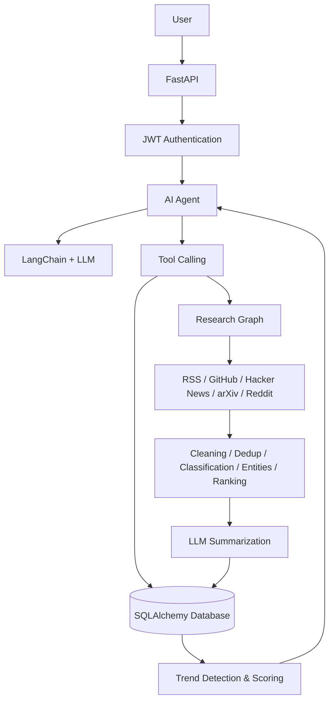

# Final Presentation Guide — AI Intelligence Platform

## 1. Business Problem
AI/technology information is fragmented across RSS feeds, GitHub, Hacker News, arXiv, and Reddit. Manually monitoring these sources is slow, repetitive, and makes it difficult to identify emerging topics.

## 2. Proposed Solution
A Python-based AI Intelligence Platform continuously collects multi-source intelligence, cleans and enriches it, summarizes important stories with an LLM, stores structured knowledge, detects trends, and exposes an authenticated AI Agent that can choose tools to answer user questions.

## 3. System Architecture

## 4. Database Design
`Article` is the central entity. It has a one-to-one `Summary` and many-to-many relationships with `Category`, `Entity`, and `Topic`. Alembic manages migrations. Phase 9 adds `User` for authentication.

## 5. Backend Architecture
FastAPI exposes authentication, chat, intelligence, trends, research, repositories, RAG/knowledge-base, analytics, and health endpoints. Dependencies provide database sessions and authenticated-user checks. The service/graph layers keep API concerns separate from AI orchestration.

## 6. Authentication
Users register and log in with email/password. Passwords are stored as salted PBKDF2-SHA256 hashes. Login returns a signed JWT. Protected endpoints require a bearer token.

## 7. AI Architecture
The AI layer contains the LLM service used by summarization plus a separate LangChain tool-calling agent. The agent is grounded in application tools and is instructed not to invent tool-derived facts.

## 8. LangChain
LangChain provides the chat-model integration and structured tools. `ChatOpenAI` is bound to the application tools so the model can request tool calls.

## 9. LangGraph
LangGraph manages state and control flow. The Research Graph runs the intelligence pipeline; the AI Agent Graph loops between the model and tools until the model produces a final response.

## 10. Agent & Tool Calling
The agent can call:
- `search_articles`
- `get_topic_articles`
- `list_trends`
- `run_fresh_research`

The model chooses whether a tool is necessary and can make multiple tool calls in one request.

## 11. n8n Workflows
**Intentionally excluded.** The project is designed to run directly with Python and does not require Docker or n8n.

## 12. Git/GitHub Team Workflow
Use feature branches, small focused commits, pull requests, review before merge, and a protected main branch. Keep Phase/feature work isolated and document breaking schema/API changes in the PR.

## 13. Live Demo — Complete E2E Scenario
1. Start the Python app with `python main.py`.
2. Register/login through `/auth/register` and `/auth/login`.
3. Send an authenticated question to `POST /chat`.
4. The AI Agent receives the question.
5. The model chooses from `search_articles`, `get_topic_articles`, `list_trends`, `search_knowledge_base` (RAG), and/or `run_fresh_research` — capped at `MAX_TOOL_CALLS` rounds so the agent always terminates.
6. Tools read the database (or the local RAG index) and return evidence.
7. The agent synthesizes the tool results.
8. The API returns the final answer, tool-call count, and source URLs.

For a fresh-data demonstration, call `POST /research/run` first; it executes the LangGraph research pipeline. For a RAG demonstration, call `POST /knowledge/rebuild` (or ask the agent a knowledge-base question directly — it rebuilds the index automatically if none exists yet), then ask a question the agent should answer via `search_knowledge_base`.

## 14. Challenges
Multi-source normalization, unreliable external sources, deduplication, LLM failures, database boundaries, graph state management, and keeping tool outputs grounded were the main engineering challenges.

## 15. Future Improvements
RAG and a local knowledge base are implemented (chunking, TF-IDF embeddings, cosine retrieval, reranking, metadata filtering — see `app/rag/`), not future work. Remaining optional enhancements: a real vector database (e.g. Chroma/pgvector) in place of the local TF-IDF index, customer-satisfaction analysis, voice support, multi-agent workflows beyond the current tool-calling agent, advanced analytics, WebSocket chat, cloud deployment, and advanced monitoring.

## 16. Documentation
The README explains setup and architecture. This document is the presentation narrative. API documentation is generated automatically by FastAPI at `/docs` when the server is running.
